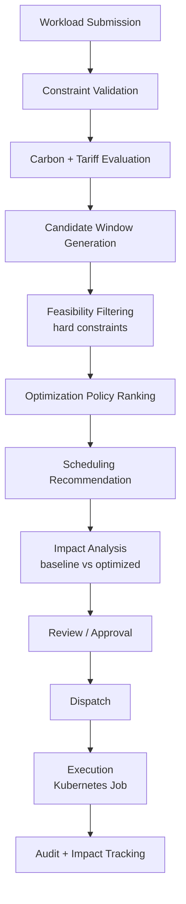
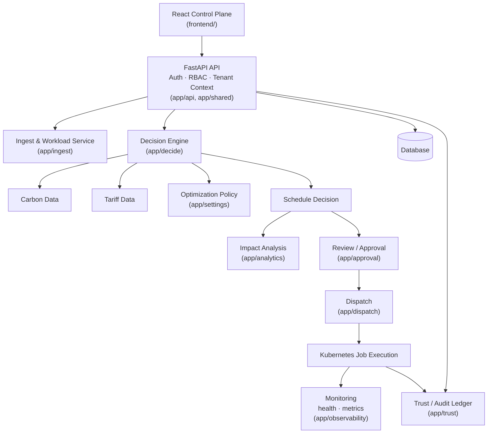

# GreenShift

**Carbon- and Cost-Aware Workload Scheduling for Sustainable Cloud Computing**

GreenShift is a multi-tenant platform that decides **when** a deferrable compute workload should run — not just where — by weighing real grid carbon intensity, real electricity tariffs, and each workload's own operational constraints. It turns "run this job sometime in the next few days" into a specific, explainable, approval-gated execution window, dispatched to Kubernetes as a native Job, with every decision measured against a baseline and recorded in a tamper-evident audit ledger.

Organizations running batch, ML training, ETL, analytics, or reporting workloads that don't need to start *immediately* can use GreenShift to reduce carbon emissions and electricity cost without violating deadlines, resource limits, or region requirements.

---

## Executive Summary

GreenShift integrates, as implemented in this repository:

- **Carbon-aware and cost-aware scheduling** over a configurable, per-organization optimization policy
- **Hard workload constraints** (deadline, earliest start, runtime, CPU/RAM/GPU, region, optional carbon budget) evaluated before any optimization ranking
- **Explainable recommendations** — every schedule decision carries its reasoning, candidate counts, and structured rejection reasons, not just a timestamp
- **Quantified impact analysis** — baseline (immediate execution) vs. GreenShift (optimized execution), for both carbon and cost
- **Human approval governance** — no workload reaches Kubernetes without an explicit Approve/Decline decision
- **Multi-tenant RBAC** — Platform Administrator, Company Administrator, and Company User roles, enforced server-side
- **A SHA-256 hash-chained Trust/Audit ledger** covering the workload lifecycle, approvals, dispatch, and policy changes

These stages are deliberately kept distinct:

| Stage | What happens |
|---|---|
| **Recommendation** | The scheduler evaluates candidate windows and proposes one — nothing executes yet |
| **Approval** | An authorized human reviews and explicitly approves or declines the recommendation |
| **Dispatch** | Only after approval, GreenShift creates a Kubernetes `batch/v1` Job for the approved window |
| **Execution** | The workload runs; status is tracked through to completion |
| **Impact measurement** | Baseline vs. actual outcome is calculated and recorded for reporting |

---

## Problem Statement

The carbon intensity of electricity varies by **time of day** and by **grid region** — running the same workload two hours later, or in a different region, can materially change its emissions footprint. Electricity tariffs vary the same way. Most batch and analytical workloads are not latency-sensitive: they have a deadline, not an instant-start requirement.

Shifting workload execution time can reduce both carbon emissions and cost — but only if it's done correctly. A workload also has real constraints: it cannot start before data is available, it must finish before its deadline, it needs specific CPU/RAM/GPU capacity, and it may be tied to a specific region. Blindly deferring a workload to "whenever carbon is lowest" without respecting those constraints produces recommendations nobody can actually use.

GreenShift exists to produce scheduling decisions that are **simultaneously feasible and optimized** — respecting every hard constraint first, then choosing the best remaining option according to the organization's own priorities.

---

## Solution Overview



Every stage above corresponds to real, running code (`app/decide`, `app/approval`, `app/dispatch`, `app/trust`, `app/analytics`) — this is not an aspirational diagram.

---

## Key Features

| Feature | Status |
|---|---|
| Carbon-aware scheduling | ✅ Implemented |
| Cost-aware scheduling | ✅ Implemented |
| Time-based workload shifting within a deadline | ✅ Implemented |
| Region-aware scheduling (11 grid regions, 4 currencies) | ✅ Implemented |
| Hard workload constraint handling (deadline, earliest start, runtime, CPU/RAM/GPU, region, carbon budget) | ✅ Implemented |
| Contention-aware batch scheduling with capacity enforcement | ✅ Implemented |
| Configurable, policy-aware optimization (CARBON_FIRST / COST_FIRST / CARBON_CONSTRAINED) | ✅ Implemented |
| Explainable scheduling (reason, candidate counts, structured rejection reasons) | ✅ Implemented |
| Baseline vs. optimized carbon & cost impact analysis | ✅ Implemented |
| Estimated vs. actual impact comparison | ✅ Implemented |
| Human review / approval workflow | ✅ Implemented |
| Approval-gated dispatch | ✅ Implemented |
| Kubernetes-native execution (`batch/v1` Jobs) | ✅ Implemented |
| Multi-tenant architecture | ✅ Implemented |
| Role-based access control (3 roles) | ✅ Implemented |
| SHA-256 hash-chained Trust/Audit ledger | ✅ Implemented |
| React enterprise control plane (18 pages) | ✅ Implemented |
| In-app + email notifications | ✅ Implemented |
| End-to-end automated testing (Playwright) | ✅ Implemented |

---

## How GreenShift Makes a Scheduling Decision

1. **Workload requirements are received** — job type, region, power draw, runtime, CPU/RAM/GPU requests, deadline, optional earliest start, optional carbon budget, and a deferrability flag.
2. **Hard constraints are validated** at submission time (e.g. an earliest-start time that is not before the deadline) and again during scheduling.
3. **Candidate execution windows are generated** across the workload's allowed window, at hourly resolution for deferrable workloads (or a single window for non-deferrable ones), never before `now`.
4. **Infeasible candidates are removed** — deadline/SLA violations, insufficient cluster CPU/RAM/GPU, region ineligibility, missing carbon/tariff telemetry, or (if set) exceeding the workload's own `carbon_budget_kg`. This filtering happens **before** any optimization ranking and is identical regardless of which policy is active.
5. **Carbon and electricity-cost characteristics are evaluated** for every remaining candidate from real regional carbon and tariff data.
6. **The tenant's configured optimization policy** (§ below) ranks the feasible candidates.
7. **The top-ranked feasible window is selected** and persisted as a `ScheduleDecision`.
8. **The decision is returned with full supporting explanation** — not just a timestamp.

---

## Policy-Aware Optimization

GreenShift supports three optimization policies (`app/decide/optimization_policy.py`), applied identically by both the single-job scheduler and the contention-aware batch scheduler. Ranking is **deterministic and lexicographic** — there are no arbitrary weights and no blended score.

### CARBON_FIRST (default)
Minimizes carbon emissions first, electricity cost second, and earliest start time as the final deterministic tie-breaker. This is the platform's original behavior and remains the default for any tenant that has not explicitly configured a different policy.

### COST_FIRST
Minimizes electricity cost first, carbon emissions second, earliest start last.

### CARBON_CONSTRAINED
Finds the minimum achievable carbon among the feasible candidates, admits every candidate within a configurable `carbon_tolerance_pct` of that minimum, then minimizes electricity cost among only those admitted candidates. The tolerance is never silently relaxed, and the policy never silently falls back to a different one.

**Governance around policy:**
- The policy is **backend-owned per tenant** (`GET`/`PUT /api/v1/settings/optimization-policy`) — never a frontend-only or `localStorage` setting.
- Only a **Company Admin** (or Platform Admin) may change their own company's policy; a Company User can read but not modify it.
- Policy changes are recorded as `OPTIMIZATION_POLICY_CHANGED` audit events, capturing the previous and new policy, the tolerance, and the authenticated actor.
- Hard constraints — including a workload's own carbon budget — are **never affected by policy**; the policy only decides which already-feasible candidate wins.

GreenShift does not implement Pareto or weighted multi-objective optimization, and does not generate policy recommendations via machine learning; policy selection is an explicit organizational decision.

---

## Carbon and Cost Intelligence

For each candidate execution window, GreenShift evaluates:

```
Carbon impact = Energy Consumption (kWh) × Carbon Intensity (gCO₂/kWh)
Cost impact   = Energy Consumption (kWh) × Electricity Tariff (currency/kWh)
```

Carbon intensity and tariff data are sourced with a defined priority: a curated regional CSV dataset first, a live provider API second (Electricity Maps for carbon), and a clearly-labeled synthetic fallback last — every schedule decision records whether its carbon figure was live/cached or fallback-estimated (`is_fallback`).

Each region has its own real native currency (INR, AUD, SEK, or USD). Scheduling also computes an internal USD-normalized comparison figure so windows across regions can be ranked consistently — this internal figure is always labeled as USD in explanations rather than displayed as an unlabeled currency symbol, so it is never confused with a workload's real native-currency cost.

---

## Explainable Scheduling

Every `ScheduleDecision` GreenShift returns includes, where available:

- Selected execution window (`selected_start` / `selected_end`)
- The active optimization policy and (for `CARBON_CONSTRAINED`) the tolerance used
- Carbon intensity and carbon emissions for the selected window
- Electricity cost, in both native currency and the internal comparison basis
- A human-readable reason for the selection
- `candidates_evaluated` and `feasible_candidates_count`
- A structured rejection-reason breakdown for infeasible candidates (e.g. `DEADLINE_VIOLATION`, `CARBON_BUDGET_EXCEEDED`, `INSUFFICIENT_CPU`, `INSUFFICIENT_RAM`, `INSUFFICIENT_GPU`, `REGION_INELIGIBLE`, `CARBON_DATA_UNAVAILABLE`, `COST_DATA_UNAVAILABLE`)
- Baseline comparison fields and SLA outcome
- Current live cluster capacity (CPU/RAM/GPU) for context

The React control plane's "GreenShift Recommendation," "Immediate vs. GreenShift," and "Why This Window?" panels render these fields directly from the backend response — the frontend performs no independent carbon/cost calculation of its own.

---

## Impact Analysis

For every scheduled job, GreenShift computes a baseline-vs-optimized comparison:

| Metric | Meaning |
|---|---|
| `baseline_carbon_emission` | Emissions if executed at the earliest feasible moment |
| `carbon_avoided` / `carbon_reduction_pct` | Emissions saved by the optimized window vs. baseline |
| `baseline_cost` / `native_cost` | Baseline vs. selected cost, in USD and native currency |
| `cost_difference` | Cost delta vs. baseline |
| `scheduling_delay_hours` | How long the workload was deferred |
| `sla_met` | Whether the selected window still meets the deadline |

GreenShift also distinguishes **estimated** impact (from the schedule decision, before execution) from **actual** impact (measured after execution, via `GET /impact/job/{id}/actual`), and provides tenant-scoped fleet-level aggregates (`GET /impact/fleet`, `/impact/fleet/headline`) with cost savings broken out **per native currency** rather than incorrectly combined.

---

## System Architecture



| Layer | Responsibility |
|---|---|
| **React Control Plane** | Authenticated SPA for submitting workloads, reviewing recommendations, approving/declining, and viewing impact, audit, and settings. |
| **FastAPI API — Auth / RBAC / Tenant Context** | Single HTTP entrypoint; JWT authentication, role-based authorization, tenant/team scoping, and rate limiting are enforced here for every request. |
| **Ingest & Workload Service** | Registers workloads, resolves region configuration, and sources carbon/tariff telemetry. |
| **Decision Engine** | Generates and filters candidate windows and applies the tenant's optimization policy. |
| **Impact Analysis** | Computes baseline-vs-optimized and estimated-vs-actual metrics. |
| **Review / Approval** | Human governance gate between recommendation and dispatch. |
| **Dispatch** | Creates Kubernetes `batch/v1` Jobs only for approved, time-eligible workloads; supports multiple concurrent dispatcher workers via `SELECT ... FOR UPDATE SKIP LOCKED` leasing. |
| **Monitoring** | Health (`/health`) and Prometheus metrics (`/metrics`) endpoints, plus dedicated System Health and Job Monitoring views in the control plane. |
| **Trust / Audit** | Appends a SHA-256 hash-chained event for every significant action across the lifecycle. |
| **Database** | PostgreSQL (production) or SQLite (development), accessed via SQLAlchemy/Alembic-managed models. |

---

## Technology Stack

### Frontend
React 19 · TypeScript · Vite · React Router 7 · TanStack Query · Axios · Recharts · Lucide icons

### Backend
Python · FastAPI · Pydantic v2 · SQLAlchemy 2.0 · Alembic (15 migrations)

### Data & Analytics
PostgreSQL (production) / SQLite (local development & tests) · pandas · Redis (caching & rate-limit storage)

### Scheduling / Optimization
Custom deterministic constraint-first scheduler (`app/decide`) · scikit-learn `GradientBoostingRegressor` as a bounded, advisory demand-forecasting signal for contention-aware batch scheduling (soft cost nudge only — never overrides carbon/cost/deadline logic)

### Infrastructure
Docker · Docker Compose (Postgres, Redis, API, Streamlit dashboard, React frontend, ingest, scheduler, dispatcher, trust services) · Kubernetes (`kubernetes` Python client, native `batch/v1` Jobs, dedicated RBAC ServiceAccount) · Prometheus metrics (`prometheus-fastapi-instrumentator`)

### Security
PyJWT (HS256) · bcrypt · slowapi (rate limiting) · server-side RBAC · tenant isolation · SHA-256 hash-chain audit

### Testing
pytest (backend — 915 automated tests spanning unit, integration, RBAC, tenant-isolation, and security scenarios) · Vitest + Testing Library (frontend component/page tests) · Playwright (end-to-end browser tests) · TypeScript compiler checks

---

## Security and Governance

Authentication is JWT-based (`Authorization: Bearer`), with an optional API-key path for service-to-service calls. Once a token is issued, the server **re-derives role, tenant, and team from the database on every request** — client-supplied identity fields in a request body (role, tenant_id, company_id, team_id) are never trusted; registration and job-submission models don't even define those fields, so any such value a client sends is silently dropped rather than honored.

| Role | Scope |
|---|---|
| **PLATFORM_ADMIN** | Global visibility across all companies; the only role that can verify the global Trust/Audit chain or manage anchors |
| **COMPANY_ADMIN** | Full visibility and control within their own company (all teams); can manage users, change the optimization policy, and approve/decline schedules |
| **COMPANY_USER** | Scoped to their own team; can submit workloads and view read-only recommendations, but cannot approve/decline or change company settings |

Tenant-scoped resources (jobs, schedule decisions, approvals, notifications, impact, audit) are protected by server-side authorization, not just UI hiding: cross-tenant access returns `404` (existence is never leaked to another tenant), and cross-team access by a non-admin returns `403`. Dispatch to Kubernetes is only possible for a job that has already been explicitly approved — attempting to dispatch a pending or declined job is rejected server-side regardless of what the client requests. Every significant action (submission, scheduling, approval, decline, dispatch, policy change, registration) is recorded in the SHA-256 hash-chained Trust/Audit ledger with a server-derived actor, tenant, and timestamp.

---

## Multi-Tenant Architecture

```
Platform
 ├── Company A (tenant)
 │    ├── Teams
 │    ├── Users (Company Admin, Company Users)
 │    ├── Workloads & Schedule Decisions
 │    └── Audit Trail
 │
 ├── Company B (tenant)
 │    ├── Teams
 │    ├── Users
 │    ├── Workloads & Schedule Decisions
 │    └── Audit Trail
 │
 └── Platform Administration (cross-company visibility)
```

A company self-registers via `POST /companies/register`, which atomically creates the tenant, a default team, and its first Company Admin. That admin can then create additional Company Users within their own tenant. No workload, schedule decision, approval, notification, or audit record is ever visible outside the tenant (and, for non-admins, the team) it belongs to.

---

## Review → Dispatch → Execution

```
Scheduling Recommendation → Review → Approval → Dispatch → Execution → Impact + Audit
```

A schedule decision is only a *recommendation* — the job sits in `PENDING_APPROVAL` until an authorized Company Admin or Platform Admin explicitly approves or declines it via the Review workflow. Approval and dispatch are deliberately separate steps: approval records a governance decision; dispatch (triggered manually or by the background dispatcher once the approved window arrives) is what actually creates the Kubernetes Job. This separation means recommendation quality can be reviewed independently of execution, and nothing reaches the cluster without a human decision in between.

---

## Dashboard

The primary interface is the **React Control Plane** (`frontend/`), a role-aware single-page application:

| Area | What it shows |
|---|---|
| **Dashboard** | Role-specific summary (Workload Operations / Company Operations / Platform Command Center), fleet carbon & cost headline, pending approvals, cluster health |
| **Workloads** | Registry of submitted workloads with status, search, and filtering |
| **Submit Workload** | Form for new workload submission, with live region/regulatory data |
| **Scheduling Engine** | Runs/inspects the optimizer for a workload; shows the GreenShift Recommendation, the immediate-vs-GreenShift comparison, and the "Why This Window?" explainability panel |
| **Review** | Pending-approval queue with a detailed review modal (schedule comparison, decision note, Approve/Decline) and approval history |
| **Impact Reports** | Fleet-wide sustainability and cost-saving analytics, broken out by native currency, team, and region |
| **Audit / Trust** | Cryptographic hash-chain browser, filterable by job/team/actor/event type |
| **Settings** | Profile, company profile, optimization policy configuration, notification preferences |

An operational **Streamlit dashboard** (`app/dashboard/`) is also included for cluster-operator-style monitoring (jobs table, live carbon/tariff curves, Kubernetes node capacity, audit chain inspector).

All values shown in either dashboard are read directly from backend API responses — no dashboard value is computed or invented client-side.

---

## End-to-End Workflow

1. A user submits a workload with its constraints (deadline, runtime, CPU/RAM, region, etc.).
2. The workload is validated against those constraints.
3. Carbon and tariff information for the workload's region is evaluated.
4. Feasible execution windows are generated.
5. The tenant's optimization policy ranks the feasible candidates.
6. GreenShift produces a scheduling recommendation with a documented reason.
7. Expected (baseline vs. optimized) impact is calculated.
8. The user reviews the recommendation in the Review workflow.
9. Once approved, the workload becomes eligible for dispatch.
10. Execution status is tracked from dispatch through completion.
11. Actual impact is recorded and compared against the original estimate.
12. Every step above is captured as an event in the Trust/Audit ledger.

---

## Experimental Evaluation

GreenShift was evaluated across its three optimization policies using the project's 560-workload benchmark dataset, to study the trade-off between carbon reduction, cost savings, and SLA compliance on the same real, un-modified INGEST → DECIDE pipeline (`results/policy_comparison_2026-09-15/COMPARISON.md`). Each policy was run independently against its own fresh database so the three runs could not interfere with each other.

| Metric | CARBON_FIRST | COST_FIRST | CARBON_CONSTRAINED (5%) |
|---|---:|---:|---:|
| Workloads scheduled | 526 | 528 | 528 |
| Carbon avoided | **145.9 kg CO₂ (3.5%)** | 145.4 kg CO₂ (3.4%) | 134.6 kg CO₂ (3.1%) |
| Cost saved (USD) | $0.00 (0.0%) | **$107.03 (6.8%)** | **$107.03 (6.8%)** |
| Avg. scheduling delay | 0.4 h | 1.2 h | 0.9 h |
| SLA compliance | 526/526 (100%) | 528/528 (100%) | 528/528 (100%) |

**Interpretation:** `CARBON_FIRST` avoided the most carbon; `COST_FIRST` found real, tangible savings from India's Time-of-Day tariff structure while sacrificing very little carbon reduction; `CARBON_CONSTRAINED` landed in between by design. All three policies maintained 100% SLA compliance — the policy layer only reorders already-feasible candidates, it never affects deadline compliance. This experiment demonstrates that GreenShift's scheduler **adapts to the configured policy** on the same dataset; it is not a claim that any one policy is universally superior — that choice depends on an organization's own priorities.

> Results are workload- and configuration-dependent and demonstrate the behavior of the implemented scheduling policies under the evaluated workload set, not a universal performance guarantee.

A separate, full 560-workload run under the default `CARBON_FIRST` policy (`results/experiment_summary.json`) avoided 174.65 kg CO₂ against a 3,881.42 kg CO₂ baseline (4.0% mean reduction, 21.1% at the 90th percentile), with 548 of 560 workloads meeting their SLA deadline (97.9%). Because `CARBON_FIRST` optimizes for carbon rather than cost, aggregate electricity cost was slightly higher than baseline in this run ($927.26 vs. $870.60) — consistent with the A/B/C comparison above, where `COST_FIRST` is the policy that actively reduces cost.

---

## Testing and Quality

### Backend
915 automated pytest tests across the codebase, covering scheduler logic, optimization-policy ranking and persistence, workload validation, approval/dispatch gating, RBAC, tenant/team isolation, identity-spoofing resistance, and audit-chain integrity.

### Frontend
An extensive Vitest + Testing Library suite covering pages and components (forms, dashboards, decision panels, approval flows), plus TypeScript compilation checks (`tsc --noEmit`) and a production build (`vite build`) as CI-equivalent gates.

### End-to-End (Playwright)
A real-browser Playwright suite (`frontend/e2e/`) drives the actual application against a real backend — **19/19 tests passing**, covering:

- Login through the real authentication form, and the authenticated dashboard loading
- Workload submission and its appearance in the registry
- Live scheduling, with UI values cross-checked against the backend's own `ScheduleDecision` response
- Optimization-policy changes verified to actually change scheduling behavior
- The Review → Approval workflow
- Dispatch gating (unavailable before approval, available after)
- Impact and audit information, including independent recomputation of the audit ledger's hash chain
- Logout and session invalidation
- Five dedicated security tests: unauthenticated access is blocked, a Company User cannot perform admin-only actions, invalid/impossible workload windows are rejected client- and server-side, cross-tenant data access is blocked (IDOR), and dispatch is rejected before approval

Run with `npm run test:e2e` from `frontend/`.

---

## Project Differentiation

| Capability | GreenShift |
|---|---|
| Carbon-aware scheduling | ✓ |
| Cost-aware scheduling | ✓ |
| Time-based workload shifting | ✓ |
| Region-aware scheduling | ✓ |
| Hard workload constraints | ✓ |
| Configurable optimization policies | ✓ |
| Explainable recommendations | ✓ |
| Baseline & actual impact measurement | ✓ |
| Approval-controlled execution | ✓ |
| Multi-tenant RBAC | ✓ |
| Trust/Audit ledger | ✓ |
| End-to-end automated testing | ✓ |

GreenShift brings carbon-aware scheduling, economic considerations, workload constraints, explainability, governance, and an approval-gated execution workflow together in a single, integrated platform.

---

## Project Structure

```
GreenShift/
├── app/
│   ├── api/          # FastAPI routers, JWT auth, RBAC dependencies, tenant scoping
│   ├── ingest/       # Workload registration, regional registry, carbon/tariff data sourcing
│   ├── decide/       # Scheduler, batch scheduler, optimization policy, impact calculator
│   ├── approval/     # Human approval gate service
│   ├── dispatch/     # Kubernetes Job creation and dispatcher workers
│   ├── trust/        # SHA-256 hash-chain audit ledger and RBAC scoping
│   ├── analytics/    # Fleet-level impact analytics
│   ├── companies/    # Tenant/team/user registration and management
│   ├── settings/     # Optimization policy persistence
│   ├── notify/       # In-app and email notifications
│   ├── dashboard/    # Operational Streamlit dashboard
│   └── shared/       # Config, database, models, auth, timezone utilities
├── frontend/         # React 19 + TypeScript enterprise control plane
│   └── e2e/          # Playwright end-to-end tests
├── tests/            # Backend pytest suite
├── scripts/          # Experiment, setup, and verification scripts
├── alembic/          # Database migrations
├── docs/             # Architecture notes and decision records
├── results/          # Experimental evaluation artifacts
├── k8s/              # Kubernetes manifests (namespace, RBAC, deployments)
└── README.md
```

---

## Getting Started

### Prerequisites
Python 3.10+, Node.js 18+, and either a local Kubernetes cluster (Docker Desktop, Kind, k3s) for full dispatch functionality or none at all for local development (the app degrades gracefully without a cluster).

### 1. Clone and configure
```bash
git clone <repository-url>
cd Greenshift
cp .env.example .env   # set JWT_SECRET_KEY and any provider keys you have
```

### 2. Backend
```bash
pip install -r requirements.txt
python -m uvicorn app.api.main:app --reload
```
Database migrations run automatically on startup (SQLite by default for local development). The API is available at `http://localhost:8000` (`/docs` for the interactive OpenAPI UI, `/health` for status).

### 3. Frontend (React Control Plane)
```bash
cd frontend
npm install
npm run dev
```
Available at `http://localhost:3000`.

### 4. Full stack via Docker Compose
```bash
docker compose up -d
```
Brings up PostgreSQL, Redis, the API, the React control plane (`:3000`), the Streamlit operational dashboard (`:8501`), and the ingest/scheduler/dispatcher/trust services together.

### 5. Run the tests
```bash
pytest tests/                        # backend
cd frontend && npm test              # frontend unit/component
cd frontend && npm run test:e2e      # end-to-end (starts both servers automatically)
```

---

## Demo / User Roles

GreenShift has no built-in demo accounts or seeded credentials — every account is created through the real registration flow, which is the same one a production user would use:

| Role | How the account is created |
|---|---|
| **Company Admin** | Self-registers their company via the "Register your organization" flow, which creates the tenant, a default team, and this account together |
| **Company User** | Created by their own company's Admin, from Settings → Users & Access |
| **Platform Administrator** | Provisioned directly by the platform operator (not self-service) |

---

## Future Enhancements

The following are logical extensions consistent with the current architecture, not implemented today:

- Multi-region candidate evaluation (today, region is a required input per workload — GreenShift optimizes *when* a workload runs, not *where*)
- Pareto/multi-objective optimization as an operational policy (currently out of scope by design; see `docs/DECISIONS.md`)
- Predictive, longer-horizon carbon and tariff forecasting beyond the current live/cached/fallback data hierarchy
- Additional cloud/Kubernetes execution targets beyond a single cluster
- Expanded fleet-level analytics and larger-scale, multi-day benchmarking

---

*GreenShift — carbon- and cost-aware scheduling, with governance and evidence built in.*
